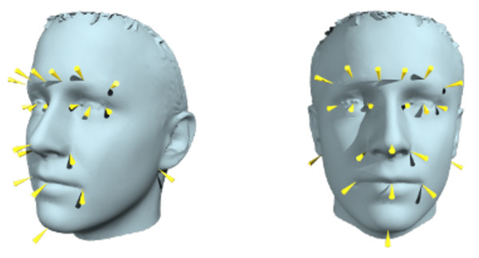

# AFLW2COCO: convert AFLW annotation into COCO format

  

Annotated Facial Landmarks in the Wild ([AFLW](https://www.tugraz.at/institute/icg/research/team-bischof/lrs/downloads/aflw/#)) [1] provides a large-scale collection of annotated face images gathered from the web, exhibiting a large variety in appearance (e.g., pose, expression, ethnicity, age, gender) as well as general imaging and environmental conditions. In total about **25k faces** are annotated with up to **21 landmarks** per image.

In this repo, we provide a script for converting annotations into a COCO-style json file, which can be used by the provided PyTorch data loader.

**Requirements**

- For annotation conversion:
  - sqlite3
  - json

- For the data loader and visualization

  - pytorch (version > 1.0)

  - opencv

  - [cocoapi](https://github.com/cocodataset/cocoapi) 

    

**Step 1: Download dataset**

Download the dataset following the instruction described [here](https://www.tugraz.at/institute/icg/research/team-bischof/lrs/downloads/aflw/). After downloading, extract  dataset files under a single directory, i.e., the root directory of the AFLW dataset. Such a directory should be as follows:

~~~
├── aflw-changelog.txt
├── aflw.sqlite
└── flickr
    ├── 0
    ├── 2
    └── 3
~~~

**Step 2: Convert original annotations into COCO format** 

Original AFLW annotations (SQLite format) can be converted to COCO-style json format by using the script `convert2coco.py` as follows:

~~~
python3 convert2coco.py -h
usage: Convert AFLW dataset's annotation into COCO json format [-h] [-v] [--dataset_root DATASET_ROOT] [--json JSON]

optional arguments:
  -h, --help            show this help message and exit
  -v, --verbose         increase output verbosity
  --dataset_root DATASET_ROOT
                        AFLW root directory
  --json JSON           output COCO json annotation file
~~~

where `<dataset_root>` is the root directory  of AFLW dataset (see above). After conversion, a .json file will be stored under the filename given by the argument `--json` (by default `aflw_annotations.json`).

**Dataset visualization** 

An auxiliary script for loading (using PyTorch data loader) and visualizing AFLW is also provided as `visualize_dataset.py`. For using this script, you need to install [cocoapi](https://github.com/cocodataset/cocoapi).

~~~
python3 visualize_data.py -h
usage: Visualize AFLW dataset (COCO-style annotations) [-h] [-v] [--batch_size BATCH_SIZE]
                                                       [--dim DIM]

optional arguments:
  -h, --help            show this help message and exit
  -v, --verbose         increase output verbosity
  --batch_size BATCH_SIZE
                        set batch size
  --dim DIM             input image dimension
~~~

**TODO**
- [x] Dataset visualization
- [ ] Compute dataset statistics

[1] Koestinger, Martin, et al. "Annotated facial landmarks in the wild: A large-scale, real-world database for 
facial landmark localization." *2011 IEEE international conference on computer vision workshops (ICCV  workshops)*. IEEE, 2011.

